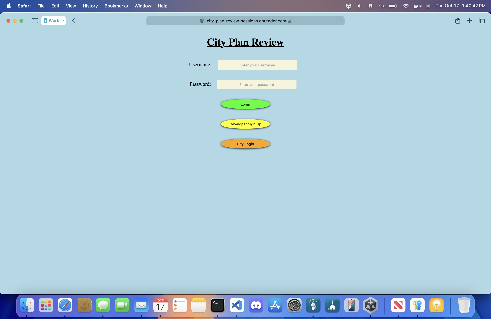
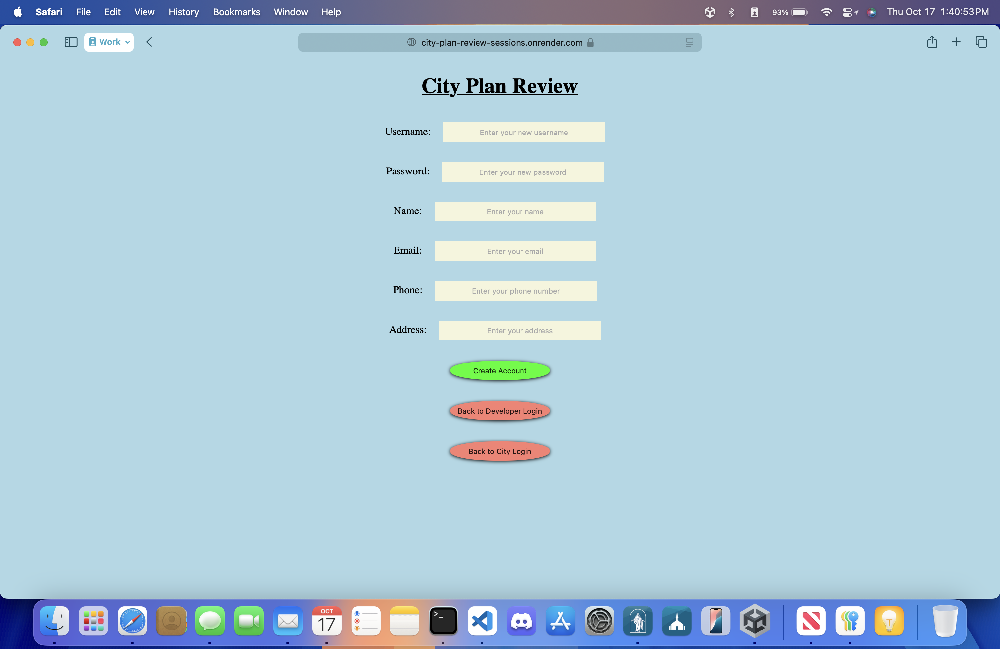

# City Plan Review with Authentication

This is a new addition to my midterm project for my SE-4200 Web Application Development 2 class. It adds user authentication to the City Plan Review web application. The backend uses Express.js built on Node.js for the server and is connected to a MongoDB database to store the data. The backend also uses Bcrypt to encrypt user passwords before storing them to the database.  The frontend uses Vue.js for interactivity with vanilla HTML and CSS for the styling. I also personally deployed this application using Render.

